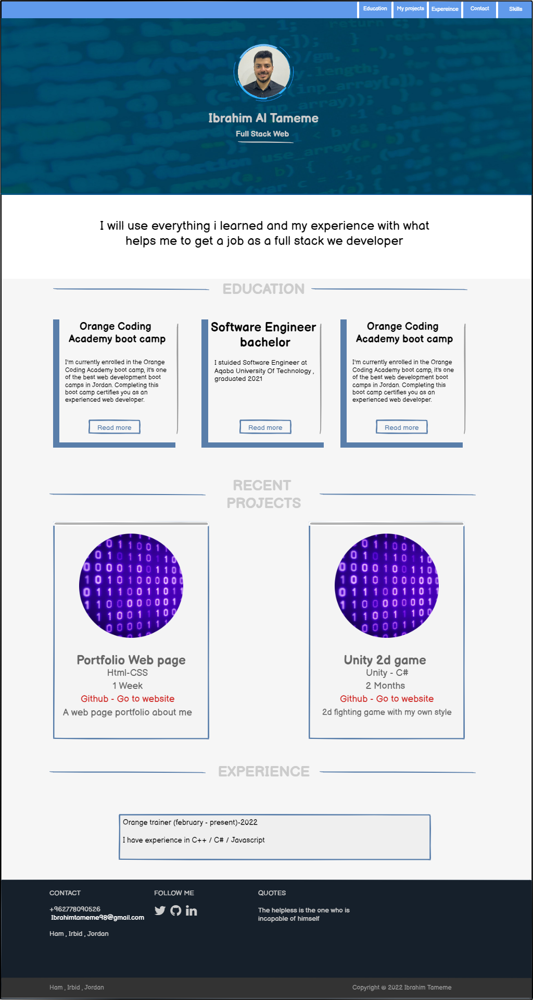

# Portfolio Web Page 

## A portfolio web page that i created as the project #1 for the Orange coding academy.
## I used 
1. Html
2. Css 
## building this webpage on Visual studio also used Boostrap 4.0.
[Live-link](https://ibrahimtameme.github.io/First-Project-Portfolio/)

### Mock up 
